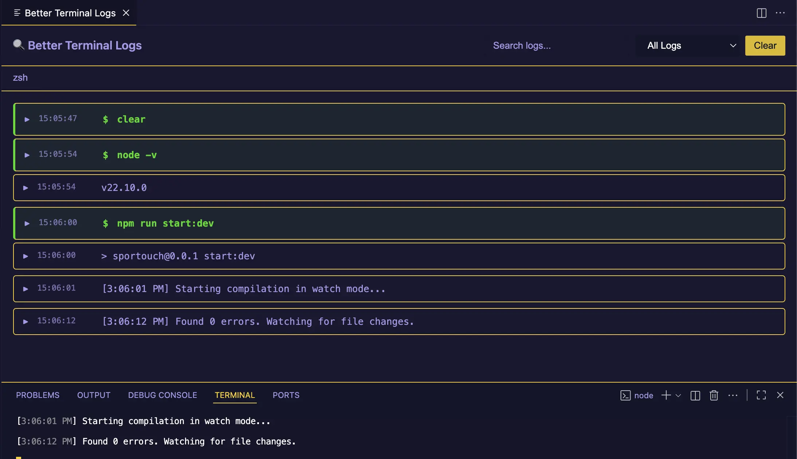

# Better Terminal Logs

A powerful VS Code extension that automatically captures output from **all your terminals** and displays them in a beautiful, CloudWatch-style webview panel with advanced filtering, search, and real-time updates.


## 📸 Preview



*CloudWatch-style log viewer with multi-terminal tabs, search, filtering, and smart error/warning detection*

## ✨ Features

### 🔄 Automatic Terminal Capture
- **Zero configuration required** - automatically captures ALL terminals
- Works with integrated terminals, task runners, and debug consoles
- Starts capturing as soon as VS Code opens
- Historical logs preserved - see logs even if you open the panel later

### 📊 CloudWatch-Style Display
- **Collapsible log entries** with timestamp and preview
- Each log shows date/time and truncated preview
- Expand to see full multi-line output
- Clean, organized view similar to AWS CloudWatch

### 🎨 Smart Log Detection & Styling
- **Commands** (green with `$` prefix) - Your typed commands
- **Errors** (red with `✗` prefix) - Errors, exceptions, failures
- **Warnings** (orange with `⚠` prefix) - Warnings, deprecations
- **Normal output** (default) - Regular terminal output

Detects 15+ error patterns and 5+ warning patterns automatically!

### 🔍 Advanced Search & Filtering
- **Real-time search** - Find text across all logs instantly
- **Type filters** - Show only errors, warnings, commands, or normal logs
- **Combined filtering** - Search AND filter simultaneously
- Filters persist when switching between terminals

### 📑 Multi-Terminal Tabs
- **Tab interface** - One tab per terminal
- Switch between terminals seamlessly
- Auto-detects terminal names
- Close terminals removes their tabs

### ⌨️ Quick Access
- **Keyboard shortcut**: `cmd+shift+l` (Mac) or `ctrl+shift+l` (Windows/Linux)
- **Command palette**: "Better Terminal Logs: Show Better Logs"
- **Instant activation** with notification on startup

### 🧹 Clean Output
- Automatically removes ANSI escape codes
- Filters out shell prompt artifacts (`%` from zsh)
- Removes terminal control sequences
- Clean, readable logs

## 🚀 Installation

### From VS Code Marketplace *(Recommended)*

1. Open VS Code
2. Go to Extensions (`cmd+shift+x` or `ctrl+shift+x`)
3. Search for "Better Terminal Logs"
4. Click **Install**
5. Extension activates automatically!

**Or install from command line:**
```bash
code --install-extension dmytro-ivashchuk.better-terminal-logs
```

> **Note:** The extension activates automatically when VS Code starts - no configuration needed!

## 📖 Usage

### Quick Start

1. **Open any terminal** in VS Code - it's automatically captured
2. **Press `cmd+shift+l`** (Mac) or `ctrl+shift+l` (Windows/Linux) to view logs
3. **Use search and filters** to find what you need

That's it! The extension works out of the box.

### Viewing Logs

**Open the panel:**
- Press `cmd+shift+l` (Mac) or `ctrl+shift+l` (Windows/Linux)
- Or: Command Palette → "Better Terminal Logs: Show Better Logs"

**Switch terminals:**
- Click terminal tabs at the top

**Filter logs:**
- Use the dropdown: All / Errors / Warnings / Normal / Commands

**Search logs:**
- Type in the search box for real-time filtering

**Clear logs:**
- Click "Clear" button to clear current terminal's logs

### Example Workflow

```bash
# Run commands in any terminal
$ npm install
$ npm start
$ node app.js
Error: Cannot find module 'express'
```

**In Better Logs panel, you'll see:**
```
$ npm install                  ← Green (command)
  added 150 packages...        ← Normal
  
$ npm start                    ← Green (command)  
  ⚠ Warning: deprecated...     ← Orange (warning)
  Server running...            ← Normal

$ node app.js                  ← Green (command)
  ✗ Error: Cannot find...      ← Red (error)
```

## 🔧 How It Works

### Architecture

1. **Terminal Detection** (`onDidOpenTerminal`)
   - Registers all terminals when created
   - Assigns unique ID and name to each

2. **Shell Integration API** (`onDidStartTerminalShellExecution`)
   - Captures commands and their output
   - Works with terminals that have shell integration enabled
   - Provides structured data (command vs output)

3. **Log Processing Pipeline**
   ```
   Raw Terminal Data
         ↓
   Remove ANSI codes & control sequences
         ↓
   Filter shell prompt artifacts (%)
         ↓
   Detect log type (error/warning/command/normal)
         ↓
   Store in memory (terminalLogs map)
         ↓
   Send to webview (if panel open)
         ↓
   Display with search/filter applied
   ```

4. **Historical Replay**
   - Logs stored in memory even when panel closed
   - When panel opens, all stored logs replayed
   - Full history available immediately

## 📋 Commands

| Command | Keyboard Shortcut | Description |
|---------|------------------|-------------|
| `better-terminal-logs.showBetterLogs` | `cmd+shift+l` (Mac)<br>`ctrl+shift+l` (Win/Linux) | Opens the Better Terminal Logs panel |

## 🎯 Log Type Detection

### Errors (Red)
Detects: `error`, `failed`, `failure`, `exception`, `fatal`, `cannot`, `unable to`, `not found`, `invalid`, `denied`, `refused`, `exit code [1-9]`, stack traces (`at Module...`), `[ERROR]`, `ERR!`, `✗`, `❌`, `⨯`

### Warnings (Orange)
Detects: `warn`, `warning`, `caution`, `deprecated`, `[WARN]`, `⚠`

### Commands (Green)
All commands captured from shell execution

### Normal (Default)
Everything else

## 🛠️ Technology Stack

- **TypeScript** - Extension logic
- **VS Code Extension API** - Shell Integration, Webview, Commands
- **VS Code Shell Integration API** - Terminal output capture (v1.93+)
- **HTML/CSS/JavaScript** - Webview UI (`src/webview/index.html`)
- **VS Code Theme Variables** - Native theming support

## ⚙️ Configuration

Currently, the extension works out-of-the-box with no configuration needed. Future versions may add settings for:
- Maximum log history size
- Custom log patterns
- Auto-clear on terminal close
- Log export format

## 🐛 Known Issues

### npm Script Execution from VS Code UI
**Issue:** When you run npm scripts by hovering over `package.json` and clicking "Run Script", logs may not capture properly.

**Reason:** VS Code creates these terminals without shell integration enabled, so the `onDidStartTerminalShellExecution` API doesn't fire.

**Workaround:** Run npm scripts manually in the terminal:
```bash
npm run start
```

**Status:** Investigating alternative capture methods for these terminals.

### Shell Integration Required
The extension relies on VS Code's Shell Integration API (introduced in v1.93). Ensure:
- You're using VS Code 1.93 or later
- Shell integration is not disabled in settings
- Your shell supports integration (bash, zsh, fish, pwsh)

### Memory Usage
All logs are stored in memory. For long-running terminals with massive output, consider clearing logs periodically using the "Clear" button.

## 🧪 Development

### Setup for Development

1. **Clone the repository:**
   ```bash
   git clone https://github.com/DimaIvashchuk/better-terminal-logs-vscode-extension.git
   cd better-terminal-logs-vscode-extension
   ```

2. **Install dependencies:**
   ```bash
   npm install
   ```

3. **Open in VS Code:**
   ```bash
   code .
   ```

4. **Run the extension:**
   - Press `F5` to open Extension Development Host
   - Test your changes in the new window

5. **Make changes:**
   - Edit `src/extension.ts` for backend logic
   - Edit `src/webview/index.html` for UI
   - Run `npm run compile` to compile TypeScript

### Project Structure
```
better-terminal-logs-vscode-extension/
├── src/
│   ├── extension.ts        # Main extension logic
│   └── webview/
│       └── index.html      # Webview UI
├── out/                    # Compiled JavaScript
├── package.json            # Extension manifest
├── tsconfig.json          # TypeScript config
└── README.md
```

### Key Files

**`src/extension.ts`**
- Terminal registration and capture
- Log processing and cleaning
- Shell Integration API listeners
- Webview panel management

**`src/webview/index.html`**
- Tab management
- Log rendering (CloudWatch style)
- Search and filter UI
- Real-time updates via `postMessage`

### Testing

Run npm scripts in the integrated terminal and verify:
- ✅ Logs appear in Better Logs panel
- ✅ Commands shown in green with `$` prefix
- ✅ Errors shown in red with `✗` prefix
- ✅ Search filters logs in real-time
- ✅ Type filter works correctly
- ✅ Logs persist when panel closed/reopened

## 🤝 Contributing

Contributions are welcome! To contribute:

1. **Fork the repository** on GitHub
2. **Clone your fork** and set up the development environment (see [Development Setup](#setup-for-development))
3. **Create a feature branch:**
   ```bash
   git checkout -b feature/amazing-feature
   ```
4. **Make your changes** and test thoroughly
5. **Commit your changes:**
   ```bash
   git commit -m 'Add amazing feature'
   ```
6. **Push to your fork:**
   ```bash
   git push origin feature/amazing-feature
   ```
7. **Open a Pull Request** on GitHub

### Contribution Guidelines

- Follow the existing code style (TypeScript, ESLint)
- Test your changes in Extension Development Host (`F5`)
- Update documentation if adding new features
- Add your changes to `CHANGELOG.md`
- Keep commits focused and descriptive

## 📄 License

MIT

## 🙏 Acknowledgments

- VS Code Extension API documentation
- Shell Integration API (VS Code 1.93+)
- AWS CloudWatch UI inspiration

---

**Enjoy cleaner, more organized terminal logs!** 🚀

*Made with ❤️ for developers who love clean terminals*
